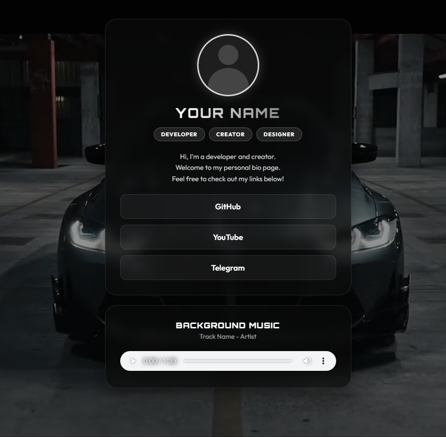

# Шаблон Link-in-Bio

Стильный, современный и полностью открытый шаблон визитки "Link-in-Bio" для разработчиков, криэйторов и художников. Включает видео-фон, 3D-анимацию при наведении мыши, кастомные шрифты и аудиоплеер.

## Особенности
* Видео фон: Легко добавьте свой собственный .mp4 зацикленный фон
* 3D эффект наклона: Карточка плавно поворачивается вслед за курсором мыши
* Glassmorphism дизайн: Полупрозрачные карточки с размытием заднего фона и мягкими тенями
* Музыкальный плеер: Встроенный аудиоплеер для фоновой музыки (стилизованный под общую тему)
* Адаптивность: Отлично выглядит как на ПК, так и на мобильных устройствах

## Как использовать

1. Склонируйте или скачайте этот репозиторий
2. Замените медиафайлы на свои:
   * avatar.png (ваша аватарка)
   * bg_video.mp4 (ваш фоновый видеоролик)
   * bg_music.ogg (ваш фоновый трек)
3. Откройте index.html в любом текстовом редакторе и измените текст:
   * Имя / Никнейм
   * Теги (Developer, Creator и т.д.)
   * Описание (Description)
   * Ссылки (GitHub, Telegram, YouTube)
4. Разместите на GitHub Pages, Vercel или любом другом веб-сервере!

## Кредит
Изначально основано на дизайне от FrizeDev. Переработано в универсальный open-source шаблон.
